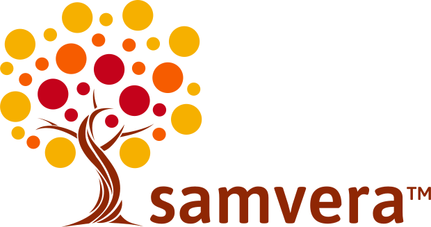

# Hyrax: A Digital Repository Framework

Code: 

Docs: 

Jump in: 

## Table of Contents

* [What is Hyrax?](#what-is-hyrax)
* [Getting Help and Asking Questions](#getting-help-and-asking-questions)
* [How to Run the Code](#how-to-run-the-code)
* [Contribute](#contribute)
* [Release Process](#release-process)
* [Deploy](#deploy)
* [Acknowledgments](#acknowledgments)
* [License](#license)

## What is Hyrax?

Hyrax is a [Ruby on Rails Engine](https://guides.rubyonrails.org/engines.html) built by the [Samvera community](https://samvera.org). Hyrax provides a foundation for creating many different digital repository applications.

_**Note:** As a Rails Engine, Hyrax is not a web application. To build your digital repository using Hyrax you must mount the Hyrax engine within a Rails application. We call an application that mounts Hyrax a "Hyrax-based application" (or sometimes a "Hyrax Application")._

Hyrax offers the ability to:

* Create repository object types on demand
* Deposit content via multiple configurable workflows
* Describe content with flexible metadata
* Enable/disable optional features via an administrative dashboard
* And more (https://hyrax.samvera.org/about/)

## Getting Help and Asking Questions

More detailed documentation about Hyrax is available on the [Hyrax Github Wiki](https://github.com/samvera/hyrax/wiki) but if you have questions or need help, please email the [Samvera community tech list](https://samvera.atlassian.net/wiki/spaces/samvera/pages/1171226735/Samvera+Community+Email+Lists#Samvera-Tech-(15-20-messages-per-week-on-average)) or stop by the #dev channel in the [Samvera community Slack team](https://samvera.atlassian.net/wiki/spaces/samvera/pages/405211682/Getting+Started+in+the+Samvera+Community#Join-the-Samvera-Slack-workspace). You can also get in touch with the [Hyrax Maintenance Working Group](https://samvera.atlassian.net/wiki/spaces/samvera/pages/496632295/Hyrax+Maintenance+Working+Group), including the Hyrax Product Owner and Hyrax Tech Lead.

[Reporting Issues](./.github/SUPPORT.md)

## How to Run the Code

[Run Hyrax Locally Using Docker](./CONTAINERS.md)

Hyrax can also work running prerequisite dependencies separately. The following describe ways to do this:
* [Developing Your Hyrax-based Application](./documentation/developing-your-hyrax-based-app.md)

## Contribute

We'd love to accept your contributions. Please see our [guide to contributing to Hyrax](./.github/CONTRIBUTING.md).

[Installing Analytics](https://github.com/samvera/hyrax/wiki/Hyrax-Management-Guide#installing-analytics)

## Release Process

See the [release management process](https://github.com/samvera/hyrax/wiki/Release-management-process).

We also have a [Maintenance Policy](./documentation/MAINTENANCE.md).

## Deploy

Steps to deploy a Hyrax-based application to production will vary depending on your particular ecosystem but here are some methods and things to consider:
* [Hyrax Management Guide](https://github.com/samvera/hyrax/wiki/Hyrax-Management-Guide) (provides guidance for things to keep in mind in production environments)
* [Helm Chart to deploy Hyrax-based application](./CONTAINERS.md#deploying-to-production) (for cloud-based Kubernetes-style deployments)

## Acknowledgments

This software has been developed by and is brought to you by the Samvera community.  Learn more at the
[Samvera website](http://samvera.org/).

This project is tested with Browserstack.

## License

Hyrax is available under [the Apache 2.0 license](LICENSE).
